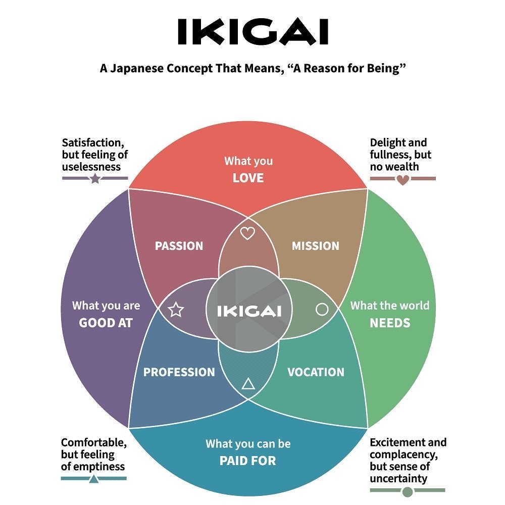

In the quiet tapestry of life, where the threads of fate intertwine in unforeseen patterns, there lies a story — a simple yet profound narrative of a Chinese farmer that has the power to transform our understanding of fortune, perspective, and the essence of life itself. I stumbled upon this story during my morning meditation, and unbeknownst to me, it would change the way I perceived the ebbs and flows of existence.

## The Unfolding of Events

Our tale begins in a humble village with a farmer and his son, whose lives are deeply woven with their beloved horse. This horse was more than a mere animal; it was the heartbeat of their livelihood, a silent partner in their life journey. Then, one day, as if the winds of change decided to alter their course, the horse vanished, leaving behind a void that echoed through their daily existence.

Upon hearing this, the neighbours rushed to the farmer's side, their voices laced with pity: *"Your horse ran away — what terrible luck!"*

But the farmer, with a gaze as serene as a still lake, responded:

> *"Maybe so, maybe not."*

In a twist that none could have anticipated, the horse returned — not alone, but with a band of wild horses following. Wide-eyed and astonished, the same neighbours proclaimed, *"What great luck!"*

Yet, unmoved by the turn of events, the farmer replied again:

> *"Maybe so, maybe not."*

The story took another turn when the farmer's son, in an attempt to tame one of the wild horses, found himself on the ground, his leg broken by the fall. The chorus of neighbours was quick to return, their words now filled with a sorrowful melody: *"What terrible luck!"*

But the farmer, consistent in his perspective, answered:

> *"Maybe so, maybe not."*

Time, the ever-flowing river, brought with it another chapter. Soldiers arrived, their march resonating through the village, with orders to recruit all able-bodied young men for the army. The son, with his broken leg, was spared. The neighbours, their voices a mix of relief and awe, declared, *"What tremendous luck!"*

And the farmer, with the wisdom of the ages, responded:

> *"Maybe so, maybe not. We'll see."*

## The Essence of the Tale

In its simplicity, this story carries many layers, each unravelling a deeper understanding of life's inherent unpredictability and the illusion of immediate judgment. It's a vivid illustration of how what we perceive as misfortune may pave the way for unforeseen blessings — and how moments of triumph may harbour seeds of future challenges.

It teaches us the value of detachment from the immediate labels of "good" and "bad," inviting us to embrace a broader perspective where events are just as they are — neither entirely positive nor negative. This tale reflects the ever-changing nature of the universe, a reminder that life is not black and white, but a spectrum of experiences, each with its essence and meaning.

## A Newfound Perspective on Mindfulness and Life

For me, the story of the Chinese farmer was more than just a narrative; it was a gateway to a more profound sense of mindfulness and acceptance. It offered a lens through which to view the sorrows of the past and the uncertainties of the future not as burdens, but as integral parts of the present moment — to be acknowledged and experienced without judgment.

This story aligns harmoniously with the principles of **Ikigai**, a Japanese philosophy that encourages finding balance and purpose in every aspect of life — be it finance, relationships, or self-discovery. It's about embracing the present, finding joy in the journey, and trusting that each step — leading us through shadows or sunshine — is precisely where we're meant to be.

## In Conclusion: Maybe So, Maybe Not

As I share this ancient wisdom with you, I invite you to ponder its significance. Reflect on the daunting or fortuitous moments in your own life — and consider how they unfolded, showing their true nature over time.

The story of the Chinese farmer, with its timeless message, might resonate with you uniquely. Whether it alters your perspective, reaffirms your beliefs, or offers a moment of reflection, I hope it inspires you to view life's tapestry with a broader lens — embracing each thread with the wisdom of:

> *"Maybe so, maybe not. We'll see."*

In this dance of life, where the music of the universe plays a tune we're all learning to understand, may we find peace in the present, wisdom in our experiences, and an unwavering trust in the unfolding journey — guided by the gentle reminder that everything, in its essence, is precisely as it should be.
